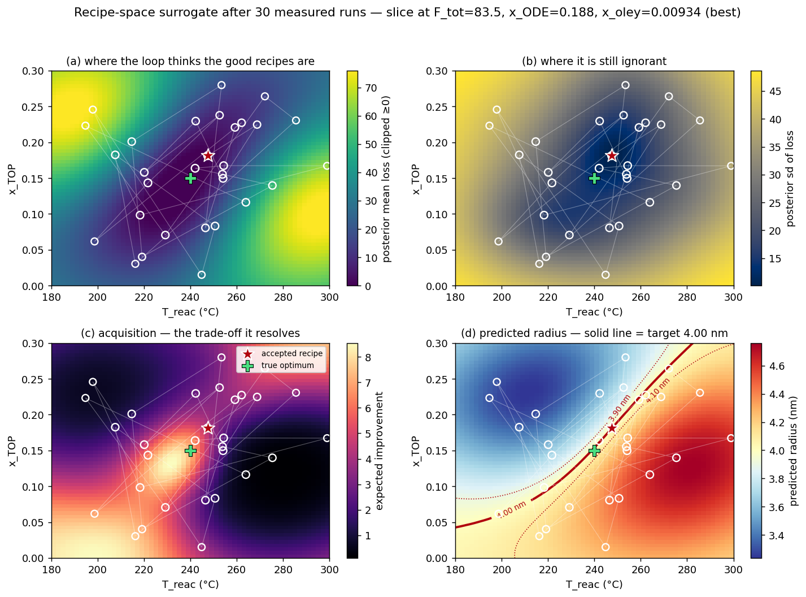
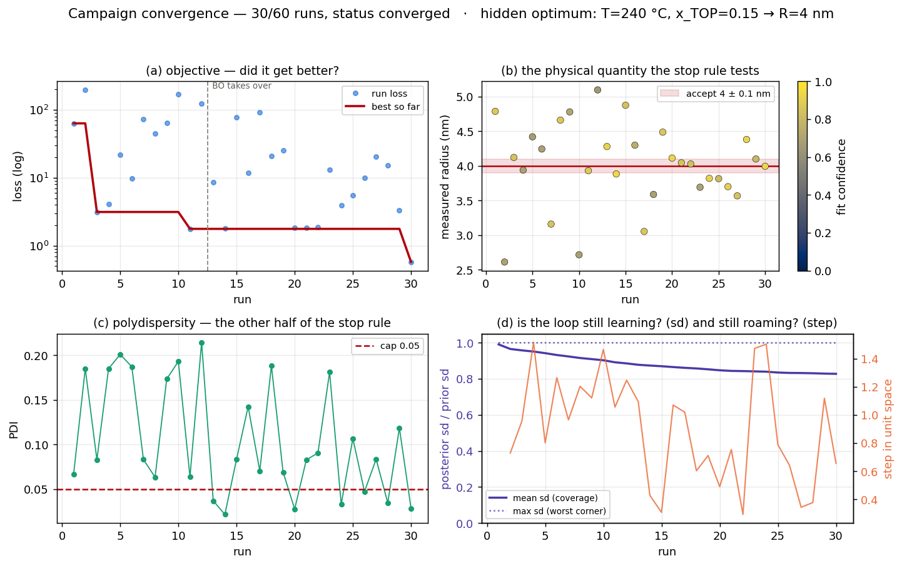
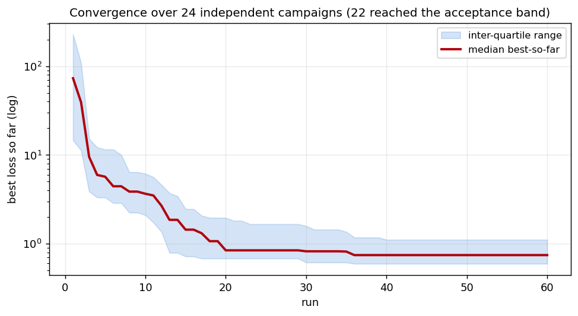
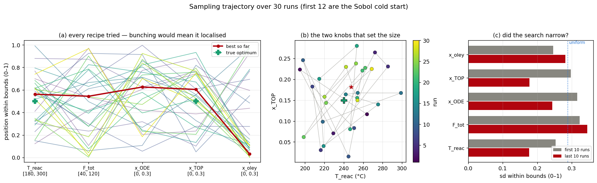
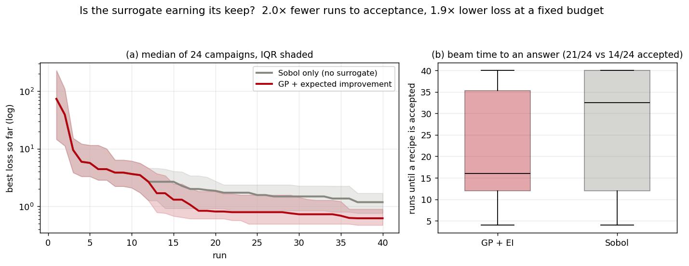

# Recipe space, prediction and convergence

How this platform's autonomous loop searches its 5-parameter recipe space, where
it predicts the next measurement, and how that prediction converges — set against
what the closed-loop-synthesis literature does.

All figures in this document were produced by the platform's **own** optimizer
(`src/optimizer/`) driving the platform's **own** hidden landscape
(`src/simulator/ground_truth.py`). Nothing is illustrative. Reproduce with:

```bash
uv run tools/campaign_plots.py --out docs/figures \
    --budget 60 --n-init 12 --tolerance 0.10 --pdi-cap 0.05 \
    --seed 3 --snapshots 12,20,30 --replicates 24 --ablation 24
```

The same renderer (`src/optimizer/plots.py`) backs the analyzer's live
**Parameter space** panel, so what you watch during beamtime and what appears
here cannot diverge.

---

## 1. Where this platform sits

**Closed-loop synthesis with scattering in the loop is very recent, and rare.**
Most self-driving labs (SDLs) close the loop on optical spectroscopy — UV–Vis or
photoluminescence — because it is fast, cheap and trivially automated. Abolhasani's
group established the pattern in flow: *Artificial Chemist* navigated a 10-parameter
perovskite quantum-dot synthesis space autonomously
([Adv. Mater. 2020](https://par.nsf.gov/biblio/10456991-artificial-chemist-autonomous-quantum-dot-synthesis-bot)),
*AlphaFlow* added reinforcement learning over variable-sequence multi-step
chemistry in a microdroplet reactor
([Nat. Commun. 2023](https://www.nature.com/articles/s41467-023-37139-y)),
and *SmartDope* reached best-in-class doped QDs in hours
([NC State](https://cbe.ncsu.edu/prof-abolhasanis-autonomous-lab-discovers-best-in-class-quantum-in-hours/)).
The AFION platform did the same for photochemically grown plasmonic
nanoparticles with in-flow spectroscopy
([Nat. Commun. 2025](https://www.nature.com/articles/s41467-025-56788-9)).
Reviews of the field are now numerous
([Nat. Synth. 2022](https://www.nature.com/articles/s44160-022-00231-0);
[Chem. Rev. 2024](https://pubs.acs.org/doi/abs/10.1021/acs.chemrev.4c00055);
[Matter 2025, on flow specifically](https://www.cell.com/matter/abstract/S2590-2385(25)00248-6)).

**X-ray scattering in the loop is the harder and more informative choice.** Two
2025 results define the state of the art and both are direct precedents for what
this platform is doing:

- Kim, Carbone, Lu, Qu, Reyes, Zhang, Zhang, Gang and Zhang, *Autonomous
  Nanoparticle Synthesis Guided by In Situ Multiscale Structural
  Characterization* ([JACS 2025](https://pubs.acs.org/doi/10.1021/jacs.5c03875),
  [OSTI](https://www.osti.gov/pages/biblio/3013673)). A droplet-flow microreactor
  coupled to in situ SAXS/WAXS with Gaussian-process optimization; **365
  experiments covered a space of ~19,000 candidate recipes**, controlling Au
  particle size over 4–60 nm at σ < 0.11. The paper also does the validation work
  this platform needs to copy: static versus flowing measurements
  indistinguishable, stable droplet transport at 100 °C, **< 5 % run-to-run
  variation**. It reports a multiscale structure–synthesis rule,
  d_c = 0.18·d + β, in which chemistry sets the intercept while the slope is
  universal — i.e. the payoff of scattering-in-the-loop is a *quantitative rule*,
  not just an optimized recipe.
- *ScatterLab* / *Autonomous nanoparticle synthesis by design*
  ([arXiv:2505.13571](https://arxiv.org/abs/2505.13571);
  [MAX IV](https://www.maxiv.lu.se/article/inventive-ai-and-robotic-self-driving-lab-accelerates-material-discoveries/)).
  Closes the loop on **total scattering and the pair distribution function**
  against a *simulated target pattern*, with no prior synthesis knowledge, and
  delivered 5 nm decahedral and 10 nm fcc Au. Its argument against optical
  feedback is the one that matters here: scattering does not require a strong
  plasmonic signal, so the approach generalises to materials where UV–Vis tells
  you nothing.

**And there is a published counterpoint worth taking seriously.** A polymer-
nanoparticle SDL that tried online SAXS alongside DLS concluded that SAXS
"currently offers limited utility for closed-loop optimisation" compared with DLS,
on grounds of automated data processing and cost
([Polym. Chem. 2025](https://pubs.rsc.org/en/content/articlehtml/2025/py/d5py00123d)).
That is precisely the gap this platform's reduction → averaging → subtraction →
quality-gate → fitting chain exists to close: the obstacle is not the physics, it
is unattended data reduction that can be trusted without a human looking at every
frame. Related: an open-source automation platform integrating SAXS for sol–gel
silica ([Digital Discovery 2025](https://pubs.rsc.org/en/content/articlehtml/2025/dd/d5dd00274e)),
and long-standing in situ SAXS studies of nucleation and growth in wet-chemical
reduction ([Nanoscale Adv. 2020](https://pubs.rsc.org/en/content/articlehtml/2020/na/c9na00569b))
and in microfluidic/synchrotron couplings
([review](https://pubmed.ncbi.nlm.nih.gov/33639513/);
[Molecules 2022](https://www.mdpi.com/1420-3049/27/14/4602)).

**On the decision side, Gaussian processes are the community default.** Noack,
Sethian and co-workers make the case for GP-driven autonomous acquisition at
synchrotron and neutron facilities
([Nat. Rev. Phys. 2021](https://www.nature.com/articles/s42254-021-00345-y)), and
show specifically that **anisotropic kernels and inhomogeneous measurement noise
matter** — real physical spaces are strongly anisotropic, and only by modelling
that do the uncertainty estimates guide the experiment well
([Sci. Rep. 2020](https://www.nature.com/articles/s41598-020-74394-1)). Their
`gpCAM` is deployed at NSLS-II and, in a recent cross-facility study, drives the
same adaptive-sampling configuration at both ALS 7.3.3 and PETRA III P03 through a
Tiled / Prefect / pyFAI / Plotly-Dash stack
([Photon Science 2025](https://pubs.acs.org/doi/10.1021/photonsci.5c00044)).
Benchmarking across materials domains supports the same conclusion: GP with
anisotropic kernels and random forests both beat the commonly used isotropic GP
([npj Comput. Mater. 2021](https://www.nature.com/articles/s41524-021-00656-9)).

Two practical conventions from that literature are used throughout this document.
First, **the uncertainty surface, not the posterior mean, is what justifies a
measurement**, and its decay — not the loss curve — is the model-side convergence
metric. (§4 shows this needs care in practice: the *maximum* posterior sd, the
statistic usually quoted, turns out to be nearly insensitive for this platform's
kernel, while the *mean* tracks learning. Both are reported, both normalised
against the GP's own prior.) Second, **a single BO trace proves nothing** — the
per-seed variance is large, so every claim below is stated over 24 independent
campaigns.

**Chemistry note.** The ligand knobs are not arbitrary. Oleylamine's role is
reviewed in [Chem. Mater. 2013](https://pubs.acs.org/doi/10.1021/cm4000476), and
amine/phosphine effects on chalcogenide morphology in
[Heliyon 2020](https://www.sciencedirect.com/science/article/pii/S2405844020319733);
for flow specifically, a 2026 InP/ZnS study achieved 2–4 nm control by varying
only **flow rate and temperature**
([Small Struct. 2026](https://onlinelibrary.wiley.com/doi/10.1002/sstr.202500538)) —
which is exactly the (T_reac, F_tot) pair this platform exposes, and a reason to
expect T and ligand fraction to dominate.

---

## 2. What the loop is actually searching

From `src/optimizer/space.py` — five knobs, with the reactor's own bounds, so the
optimizer can never propose a recipe the reactor would refuse:

| parameter | meaning | default bounds |
|---|---|---|
| `T_reac` | reaction temperature | 180 – 300 °C |
| `F_tot` | total flow (sets residence time) | 40 – 120 µL/min |
| `x_ODE` | octadecene fraction | 0 – 0.3 |
| `x_TOP` | trioctylphosphine fraction | 0 – 0.3 |
| `x_oley` | oleylamine fraction | 0 – 0.3 |

subject to `x_ODE + x_TOP + x_oley ≤ 0.9` (the remainder is precursor). That
inequality makes the feasible set a truncated simplex crossed with a box, not a
box — a mixture constraint, which is a known difficulty for space-filling designs
and for early-stage BO
([Comput. Mater. Sci. 2025](https://www.sciencedirect.com/science/article/abs/pii/S0927025625001235);
[Comput. Ind. 2024](https://www.sciencedirect.com/science/article/abs/pii/S1474034624003525)).
The platform handles it by Sobol sampling with rejection, and the diagnostics
**mask infeasible grid cells as NaN** rather than drawing a surrogate value there.

The objective, from `src/optimizer/campaign.py`, is minimised:

```
loss = ((R − R_target)/tolerance)²  +  w · (PDI / pdi_cap)
```

with `w = 1`. Fit confidence is *not* a gate — a low-confidence profile enters the
GP as a high-noise observation (`noise ∝ 1/confidence`), which is the
inhomogeneous-noise treatment Noack et al. argue for rather than the more common
practice of discarding weak measurements. Unsized profiles get a sentinel loss of
1e3. The loop stops when a **confident** run lands within `R_target ± tolerance`
**and** at or below `pdi_cap`, or when the run budget is spent.

For the figures below: target R = 4.00 nm, tolerance = 0.10 nm, `pdi_cap` = 0.05,
12 Sobol cold-start runs (in line with the ≈2d–10-point rule of thumb for initial
designs; [Ulissi group notes](https://ulissigroup.cheme.cmu.edu/F22-06-325/notes/bayesian_optimization.html),
[arXiv:2003.13826](https://arxiv.org/pdf/2003.13826)), budget 60.

The hidden landscape sets R linear in T and x_TOP with an interior PDI minimum, so
the **true optimum is T = 240 °C, x_TOP = 0.15 → R = 4.0 nm, PDI = 0.02**. The
optimizer never sees it; the figures mark it only because these runs are in silico.

---

## 3. The parameter space, as the loop sees it



*A 2-D cut through the 5-D space at the best recipe found, after 30 measured runs.
White rings are measured recipes (ring size ∝ fit confidence), the faint white
path is the order they were visited, the red star is the accepted recipe, the green
cross is the hidden optimum.*

- **(a) posterior mean loss** — the surrogate's belief. A single broad basin
  centred within a few degrees of the true optimum. Clipped at zero for display,
  because a zero-mean GP fitted to centred loss can predict a negative loss, which
  is physically impossible; the clip is the honest way to show that.
- **(b) posterior standard deviation** — the surrogate's ignorance. Low in the
  sampled middle, high in every corner. This panel, not (a), is what justifies the
  next measurement.
- **(c) expected improvement** — the trade-off resolved. Note the EI maximum sits
  *beside* the loss minimum, not on it: EI is deliberately not greedy.
- **(d) predicted radius, with the target iso-contour** — the direct answer to
  "where is the measurement predicted?" **This is the panel that changed my
  reading of the platform.** The set of recipes predicted to give 4.00 nm is not a
  point, it is a **diagonal ridge** across the (T_reac, x_TOP) plane. Higher
  temperature grows particles, more TOP shrinks them, and along the ridge the two
  cancel. The loss surface hides this, because loss is symmetric in size and so
  two-valued; only a surrogate fitted to size directly exposes it.

That degeneracy has a consequence you can measure. Over 24 campaigns the recovered
optimum is **T = 240.0 ± 8.6 °C** and **x_TOP = 0.153 ± 0.028** against true values
of 240 °C and 0.15 — *unbiased, but with the scatter running along the ridge*. The
loop reliably finds a recipe that makes the right size (best R = 3.995 ± 0.052 nm
against a 4.00 nm target); it does **not** reliably find the *same* recipe, and it
does not preferentially find the point on the ridge with the lowest PDI. With
`w = 1` and PDI ≈ 0.03 against a 0.05 cap, the size term dominates the loss by
roughly two orders of magnitude near the target, so the PDI term cannot break the
tie. Panels (a)–(c) alone would never have shown that.

Snapshots of the same slice as the campaign proceeds — 12 runs (end of the Sobol
cold start), 20 runs, 30 runs — are in
[`figures/campaign_slice_run12.png`](figures/campaign_slice_run12.png),
[`run20`](figures/campaign_slice_run20.png),
[`run30`](figures/campaign_slice_run30.png). They are worth stepping through: at
run 12 the loop has learned only the temperature dependence, so the predicted-size
contour is a nearly **vertical line at ~238 °C** (already within 2 °C of the truth).
By run 30 it has learned the competing TOP dependence too and the same contour has
rotated into the diagonal ridge. The prediction did not just get more confident, it
changed shape — which is what "learning the landscape" looks like when you can see
it.

---

## 4. Convergence



- **(a) objective.** Best-so-far falls two orders of magnitude in the Sobol phase,
  then sits **flat from run 11 to run 29** before the accepting run. Individual
  BO-phase losses still scatter over 1–100: the acquisition is exploring, not
  polishing.
- **(b) the physical quantity the stop rule tests.** Measured radius against the
  4.00 ± 0.10 nm acceptance band, coloured by fit confidence. Points scatter 2.5 –
  5.1 nm; the band is thin, and it is this panel — not the loss — that an operator
  should read during beamtime.
- **(c) polydispersity** against the cap. Mostly above 0.05, which is why runs
  land in the size band without being accepted.
- **(d) is the loop still learning, and still roaming?** Posterior sd over a
  fixed candidate pool, refitting on the first *k* observations (the Noack et al.
  metric), plus the step length between consecutive proposals in unit space.

  Two normalisations matter here and getting them wrong is easy. The **raw** max
  sd is not comparable across refits, because `GP.fit` sets the signal variance to
  `var(y)`, which *grows* as the campaign discovers worse corners — so raw sd
  rises early and looks like the model degrading when in fact the prior it is
  measured against got bigger. Both traces are therefore divided by the GP's own
  prior sd, giving "fraction of prior uncertainty remaining" in [0, 1]. And max
  versus mean answer different questions: max is the worst-covered corner, mean is
  coverage.

  **The result is the sharpest finding in this document. Mean sd falls only
  0.99 → 0.83 over 30 runs — about 17 % of the space explained — and the worst
  corner is untouched (1.000 → 0.999).** With a fixed `length_scale = 0.3` in a
  5-D unit cube, two random points are essentially uncorrelated
  (k = exp(−0.5 · 0.83 / 0.09) ≈ 0.01), so the surrogate is close to a *local
  interpolator*: it knows the neighbourhood of its observations and nothing else.
  The step length confirms it (1.06 → 0.78 against a cube diagonal of √5 ≈ 2.24) —
  the loop keeps roaming.

  This is not a reason to distrust the result. It explains it. The loop does not
  need a global model of the space, only a usable local gradient near the good
  region — which is exactly why it still beats a space-filling design by 2× (§6).
  But it does mean **the surrogate is not a map you can read off elsewhere**: the
  posterior mean in an unsampled corner of panel (a) carries almost no information.



Across 24 independent campaigns: **22/24 reached the acceptance band**, median
**16 runs** (range 4 – 60), median best loss 0.744. The median best-so-far curve
plateaus by about run 20 with a narrow inter-quartile band — the platform is
*reliable*, and its remaining spread is dominated by where the Sobol prefix
happens to land, not by the optimizer.

---

## 5. Does the search narrow?



Parallel coordinates of every recipe tried (colour = run order), the (T, x_TOP)
projection, and — because eyeballing parallel coordinates is unreliable — the
number that settles it: per-knob standard deviation in the first third versus the
last third of the campaign.

The result is more interesting than a simple yes or no. The search **narrows on
`T_reac` (0.25 → 0.18) and `x_TOP` (0.29 → 0.18)** — the two knobs the hidden
landscape actually uses — while `F_tot` (0.32 → 0.34) and `x_oley` (0.25 → 0.28)
stay at essentially the uniform-sampling spread of 1/√12 ≈ 0.29. **The loop
discovered which variables matter without being told**, and correctly kept
exploring the ones that do not. That is automatic relevance determination emerging
from the data even with a single isotropic length scale — and it is a strong hint
that giving the kernel per-dimension length scales, as Noack et al. recommend,
would let it exploit the same structure deliberately instead of incidentally.

---

## 6. Is the surrogate earning its keep?



The control that any BO claim needs: the identical controller with `n_init =
budget`, which makes it pure Sobol — same bounds, same constraint, same loss, same
simulator, same seeds, no surrogate. Over 24 seeds at a 40-run budget:

| | GP + EI | Sobol only |
|---|---|---|
| median runs to an accepted recipe | **16.0** | 32.5 |
| campaigns accepted | **21/24** | 14/24 |
| median best loss at 40 runs | **0.624** | 1.187 |

**2.0× less beam time to an answer, 1.9× better answer when time is capped, and
half again as many campaigns succeed.** The two curves are identical until run 12,
as they must be — the same Sobol prefix — and separate immediately afterwards.

For scale, Kim et al. covered ~19,000 candidate recipes in 365 experiments
([JACS 2025](https://pubs.acs.org/doi/10.1021/jacs.5c03875)); at ~16 runs per
target this platform is in the same regime, on a smaller space.

---

## 7. What I would change

Ordered by expected value per unit of work.

1. **Break the ridge degeneracy.** The size iso-contour is the finding of this
   exercise. Once the size surrogate predicts the target along a curve, choose the
   point on that curve with the lowest predicted PDI rather than letting a
   two-orders-of-magnitude-smaller PDI term decide it. Concretely: fit the PDI GP
   too (`diagnostics.fit_size_surrogate` is the template), restrict candidates to
   the predicted-size band, then minimise predicted PDI. This is the
   many-objective framing that polymer-NP SDLs already use
   ([Polym. Chem. 2025](https://pubs.rsc.org/en/content/articlehtml/2025/py/d5py00123d)).
   Cheaper interim fix: raise `weight_pdi` so the terms are comparable near the
   target.
2. **Confirm before accepting.** `_check_stop` accepts on a *single* run. In the
   replicate set one seed accepted at **run 4**, i.e. inside the Sobol cold start,
   with no adaptive run and no fitted model. Kim et al. quantify < 5 % run-to-run
   variation precisely because that number has to be established, not assumed. A
   one-run confirmation replicate at the accepted recipe would cost one run out of
   sixteen and would convert "we saw a good number once" into a claim. The
   stopping-criteria literature is moving the same way, toward regret-based and
   probabilistic guarantees rather than a threshold hit
   ([NeurIPS 2024](https://proceedings.neurips.cc/paper_files/paper/2024/file/b204de7078301292a8876a762eed3dcb-Paper-Conference.pdf);
   [Mathematics 2025](https://www.mdpi.com/2227-7390/13/20/3261)).
3. **Learn the length scales, per dimension.** `GP(length_scale=0.3)` is fixed
   and isotropic with no marginal-likelihood optimisation, and §4(d) shows what
   that costs: 30 observations remove only ~17 % of the prior uncertainty, and the
   worst-covered corner none at all. Two knobs also demonstrably matter more than
   the other three (§5), so a single shared length scale is throwing away
   structure the data is handing over. Fitting length scales by marginal
   likelihood — anisotropically — is the single change the benchmarking literature
   most supports
   ([Sci. Rep. 2020](https://www.nature.com/articles/s41598-020-74394-1);
   [npj Comput. Mater. 2021](https://www.nature.com/articles/s41524-021-00656-9)),
   and it is what `gpCAM` does at NSLS-II and ALS. Expect the gain to show up in
   the *quality at fixed budget* column of §6 rather than in runs-to-acceptance,
   for the reason given in item 5.
   *Caveat before doing this:* also report `mean_sd_rel`, not just the loss curve,
   when evaluating the change — the loss curve is insensitive to surrogate quality
   here, which is precisely the trap item 5 fell into.
4. **Refine the acquisition locally.** EI is maximised over 256 fresh Sobol points
   per iteration, reseeded each time. In 5-D that is a coarse grid *and* it injects
   noise into the argmax. A local refinement around the incumbent EI maximum would
   cost nothing measurable.
5. **A null result, recorded so nobody repeats it.** I added an opt-in
   `loss_transform="log1p"` on the theory that a loss spanning 0.3 – 200 breaks a
   stationary GP. Over 24 seeds it changed nothing: 22/24 accepted either way,
   median 16.0 vs 15.5 runs, median best loss 0.744 vs 0.767. The reason is
   §4(d) — the stop rule fires before surrogate quality becomes the binding
   constraint, so improving the surrogate cannot show up in runs-to-acceptance.
   Fix the stop rule (item 2) before re-testing any surrogate change. The flag
   defaults to `"none"`; live behaviour is unchanged.
6. **Publish the structure rule, not just the recipe.** The most transferable
   output in Kim et al. was d_c = 0.18·d + β. This platform already computes
   Guinier, Porod, Kratky and WAXS peaks alongside the form-factor fit; recording
   them against the recipe over a campaign is nearly free and is what turns beam
   time into a rule.

---

## 8. Reading the live panel during beamtime

The analyzer's **Parameter space** card serves the same three views from the live
campaign. During a run, look at:

- **slice (d)** — is the target contour a point or a ridge? If a ridge, whatever
  recipe you accept is one of many, and reproducibility claims need item 2 above.
- **convergence (b)** — measured radius against the band. This is the physical
  claim.
- **convergence (d)** — the solid line is coverage (mean posterior sd as a
  fraction of prior). If it has flattened while the loss curve is also flat, more
  runs at the same settings will not help. If it is still near 1.0, treat panel
  (a) of the slice as informative only near the white rings.
- **trajectory (c)** — which knobs narrowed. A knob that stays at uniform spread
  is a knob the objective does not depend on, and a candidate for removal from the
  space (which would make everything else converge faster).

Everything in the panel is read-only with respect to the campaign: `peek()` shows
the pending proposal without consuming it, so opening the panel mid-run cannot
change what the reactor is told to do next.

---

## Sources

- [Autonomous Nanoparticle Synthesis Guided by In Situ Multiscale Structural Characterization — JACS 2025](https://pubs.acs.org/doi/10.1021/jacs.5c03875) ([OSTI record](https://www.osti.gov/pages/biblio/3013673))
- [Autonomous nanoparticle synthesis by design (ScatterLab) — arXiv:2505.13571](https://arxiv.org/abs/2505.13571) ([MAX IV](https://www.maxiv.lu.se/article/inventive-ai-and-robotic-self-driving-lab-accelerates-material-discoveries/))
- [Gaussian processes for autonomous data acquisition at large-scale synchrotron and neutron facilities — Nat. Rev. Phys. 2021](https://www.nature.com/articles/s42254-021-00345-y)
- [Autonomous materials discovery driven by GP regression with inhomogeneous measurement noise and anisotropic kernels — Sci. Rep. 2020](https://www.nature.com/articles/s41598-020-74394-1)
- [Toward Unified Autonomous Scattering Experiments: ALS and PETRA III — Photon Science 2025](https://pubs.acs.org/doi/10.1021/photonsci.5c00044)
- [Benchmarking the performance of Bayesian optimization across multiple experimental materials science domains — npj Comput. Mater. 2021](https://www.nature.com/articles/s41524-021-00656-9)
- [Artificial Chemist: An Autonomous Quantum Dot Synthesis Bot — Adv. Mater. 2020](https://par.nsf.gov/biblio/10456991-artificial-chemist-autonomous-quantum-dot-synthesis-bot)
- [AlphaFlow: autonomous discovery and optimization of multi-step chemistry — Nat. Commun. 2023](https://www.nature.com/articles/s41467-023-37139-y)
- [Self-driving lab for photochemical synthesis of plasmonic nanoparticles (AFION) — Nat. Commun. 2025](https://www.nature.com/articles/s41467-025-56788-9)
- [Self-driving laboratory platform for many-objective self-optimisation of polymer nanoparticle synthesis — Polym. Chem. 2025](https://pubs.rsc.org/en/content/articlehtml/2025/py/d5py00123d)
- [Accelerated sol–gel synthesis of nanoporous silica via integrated SAXS — Digital Discovery 2025](https://pubs.rsc.org/en/content/articlehtml/2025/dd/d5dd00274e)
- [The rise of self-driving labs in chemical and materials sciences — Nat. Synth. 2022](https://www.nature.com/articles/s44160-022-00231-0)
- [Self-Driving Laboratories for Chemistry and Materials Science — Chem. Rev. 2024](https://pubs.acs.org/doi/abs/10.1021/acs.chemrev.4c00055)
- [The role of flow chemistry in self-driving labs — Matter 2025](https://www.cell.com/matter/abstract/S2590-2385(25)00248-6)
- [In situ SAXS of silver and bimetallic silver–gold nanoparticle formation — Nanoscale Adv. 2020](https://pubs.rsc.org/en/content/articlehtml/2020/na/c9na00569b)
- [Microfluidic synthesis coupled with synchrotron SAXS — review](https://pubmed.ncbi.nlm.nih.gov/33639513/) · [Molecules 2022](https://www.mdpi.com/1420-3049/27/14/4602)
- [Oleylamine in Nanoparticle Synthesis — Chem. Mater. 2013](https://pubs.acs.org/doi/10.1021/cm4000476)
- [Role of amine and phosphine groups in oleylamine and TOP — Heliyon 2020](https://www.sciencedirect.com/science/article/pii/S2405844020319733)
- [Large-Scale Synthesis of InP/ZnS Quantum Dots Using Continuous Flow Chemistry — Small Struct. 2026](https://onlinelibrary.wiley.com/doi/10.1002/sstr.202500538)
- [Small Angle X-ray Scattering for Nanoparticle Research — Chem. Rev.](https://pubs.acs.org/doi/10.1021/acs.chemrev.5b00690)
- [A novel constrained sampling method for mixture design — Comput. Mater. Sci. 2025](https://www.sciencedirect.com/science/article/abs/pii/S0927025625001235) · [mixed constrained BO — Comput. Ind. 2024](https://www.sciencedirect.com/science/article/abs/pii/S1474034624003525)
- [Stopping Bayesian Optimization with Probabilistic Regret Bounds — NeurIPS 2024](https://proceedings.neurips.cc/paper_files/paper/2024/file/b204de7078301292a8876a762eed3dcb-Paper-Conference.pdf) · [Determining Convergence for EI-based BO — Mathematics 2025](https://www.mdpi.com/2227-7390/13/20/3261)
- [Initial Design Strategies and their Effects on Sequential Model-Based Optimization — arXiv:2003.13826](https://arxiv.org/pdf/2003.13826) · [BO course notes, initial-design rule of thumb](https://ulissigroup.cheme.cmu.edu/F22-06-325/notes/bayesian_optimization.html)
